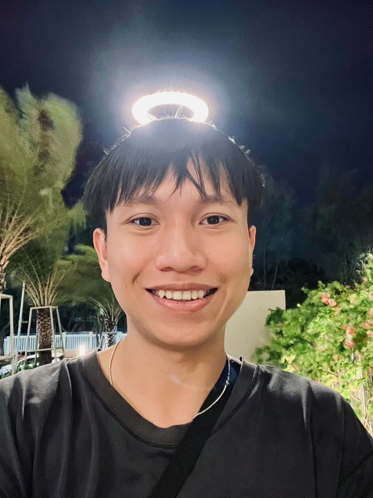

  

<table>
<tr>
<td>

# Quang Doan

**Senior Automation Engineer & QA Lead**

[linkedin.com/in/xquang-doan](https://linkedin.com/in/xquang-doan) &nbsp;•&nbsp; [github.com/zerah-doan](https://github.com/zerah-doan) &nbsp;•&nbsp; (+84) 888-688448 &nbsp;•&nbsp; [doanxuanquang9@gmail.com](mailto:doanxuanquang9@gmail.com)

</td>
<td width="180" align="right">

</td>
</tr>
</table>

---

## Professional Summary

- **Senior Automation Engineer & QA Lead** with over a decade of expertise in Software Quality Assurance, specializing in manual and advanced automated testing solutions.
- **Architected and implemented** end-to-end automation test frameworks for Web, Mobile, API, and Database applications, significantly accelerating continuous integration workflows.
- **Specialized in AI Application Testing**, possessing hands-on experience in evaluating AI Chatbots and leveraging LLMOps observability tools like Langfuse to monitor, trace, and optimize LLM outputs.
- **Leveraged Generative AI tools** (Claude Code, GitHub Copilot) to accelerate test case generation and automation scripting, optimizing engineering efficiency and delivery timelines.
- **Led and mentored** a dedicated team of 4 QA engineers, driving cross-functional collaboration, code reviews, and alignment with quality engineering standards.
- **Polyglot automation engineer** proficient in designing and maintaining scalable, multi-layered test suites across diverse technology ecosystems:
    - *Java Ecosystem:* Selenium WebDriver, Appium, TestNG, JUnit, Cucumber, RestAssured, Maven
    - *C# Ecosystem:* NUnit, MsTest, xUnit, Selenium WebDriver, RestSharp, .NET Core
    - *JavaScript / TypeScript:* Playwright, Cypress, Protractor, Jest, Mocha
    - *Python Ecosystem:* Robot Framework, Sikuli, PyTest, Selenium
    - *API & Microservices:* Postman, SoapUI, JMeter, Bruno
    - *Performance & Non-Functional:* JMeter, Locust, Accessibility compliance
- **Engineered CI/CD pipelines** by integrating automated test suites into Agile and DevOps processes using Azure DevOps, GitLab CI/CD, GitHub Actions, and Jenkins.
- **Advanced technical proficiency** in RDBMS, NoSQL, Git version control, Unix-like environments, and containerized testing using Docker & Kubernetes across Cloud platforms (AWS/Azure).

---

## Experience

### Senior Software Test Engineer — Visa Inc., Singapore
*04/2019 – Present*

- **Spearheaded comprehensive QA strategies** and end-to-end quality ownership for core Visa enterprise financial tools.
- **Architected and scaled automated testing frameworks** across multiple modern ecosystems, prioritizing TypeScript/Playwright for modern web applications and C#/.NET Core for robust backend services.
- **Leveraged Generative AI tools** (Claude Code, GitHub Copilot) within IDEs to accelerate automated test scripting, expanding test coverage while ensuring delivery timelines.
- **Established full-lifecycle AI Application Testing workflows**, utilizing Langfuse to log, trace, and monitor LLM-based chatbot outputs for accuracy and latency.
- **Engineered robust CI/CD pipelines** using Azure DevOps and GitLab CI/CD, containerizing test execution environments with Docker to run parallel test executions on Sauce Labs.
- **Developed custom internal tools** and utilities to automate complex test data queries, account lifecycle creation, and state maintenance, optimizing team velocity.
- **Collaborated on the design and review of shared automation architectures** used across global engineering teams, providing technical mentorship, code reviews, and training to junior team members.

**Tech stack:** Playwright (TypeScript core), C#, NUnit, Selenium WebDriver, Appium, Sauce Labs, Azure DevOps, GitLab CI/CD, Docker, Langfuse, Bruno, GitHub, Generative AI (Claude Code/Copilot).

### Senior Automation QA Engineer — Hansen Technologies, Ho Chi Minh City
*09/2017 – 04/2019*

- **Designed and deployed a centralized standard automation test framework** from scratch, enabling seamless migration and cross-project framework reusability.
- **Re-engineered legacy C# test platforms** by architecting a modern, scalable test automation ecosystem including decentralized test distribution, custom reporting engines, and real-time dashboard analytics.
- **Integrated automated functional and API test suites** into Jenkins CI/CD pipelines, streamlining continuous regression testing for every release cycle.
- **Implemented real-time test reporting and observability infrastructure** leveraging Elasticsearch and Kibana for advanced log analysis and rapid debugging.
- **Drove technical leadership** by conducting technical interviews for QA candidates, defining quality standards, and delivering cross-team knowledge-sharing workshops.

**Tech stack:** Java, TestNG, Cucumber, WebDriver, Sikuli, RestAssured, C#, NUnit, Jenkins, Elasticsearch, Kibana, Docker.

### Senior Automation QA Engineer — soxes GmbH, Ho Chi Minh City
*03/2016 – 09/2017*

- **Conducted code walkthroughs and static analysis** alongside development teams to architect highly effective unit testing strategies using Java, JUnit, and Mockito.
- **Developed cross-platform automation test frameworks** using Java and TestNG to support automated daily regression runs across both Web and Mobile devices (Appium).
- **Maintained and optimized legacy Protractor test scripts** while progressively migrating core test paths to modern Java-based automation alternatives.
- **Bridged the gap between product management and engineering** by analyzing complex system requirements within fast-paced Agile/Sprint cycles, performing critical manual exploratory testing when necessary.

**Tech stack:** Java, JUnit, Mockito, TestNG, Selenium WebDriver, Appium, JavaScript, Jasmine, Protractor.

### Automation QA Engineer — Filestring, Ho Chi Minh City
*08/2014 – 03/2016*

- **Authored reusable custom keywords and shared libraries** for Robot Framework in Python, automating file system reading, automated email verifications, and automated bug logging via APIs.
- **Designed and deployed Selenium Grid architecture** to scale concurrent automated test script execution across diverse browser environments.
- **Executed non-functional performance and load testing** using Apache JMeter to pinpoint system bottlenecks and validate backend responsiveness.

**Tech stack:** Python, Robot Framework, Selenium Grid, JMeter.

### Junior QA Engineer / Intern — FPT Software, Ho Chi Minh City
*09/2011 – 08/2014*

- **Authored detailed test specifications**, executed manual test suites, and managed the complete defect lifecycle (logging, tracking, and verification).
- **Facilitated daily Agile standups and status alignment calls** directly with international clients to clarify product requirements and communicate sprint progress.

---

## Education

### Bachelor of Software Engineering — FPT University, Ho Chi Minh City
*09/2009 – 06/2013*

---

## References

References available upon request.
